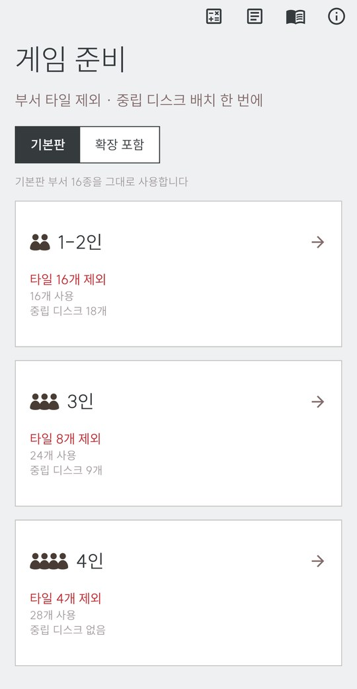
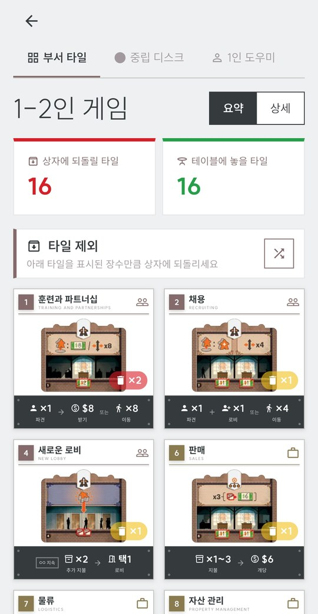
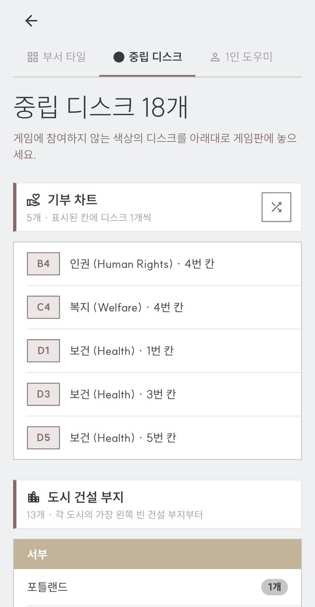
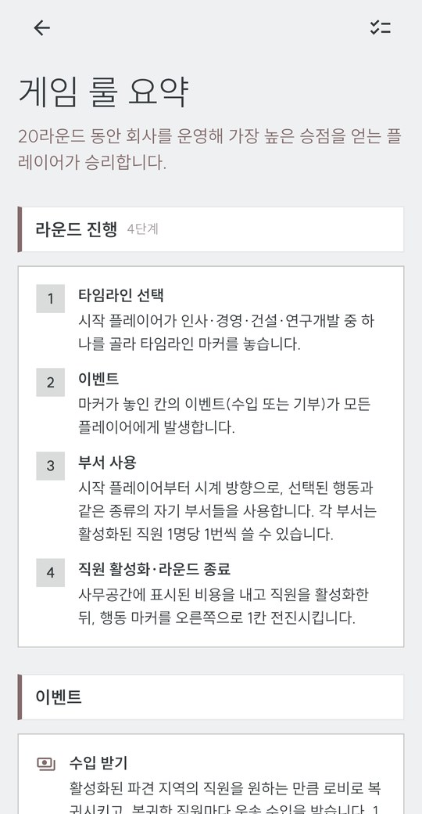
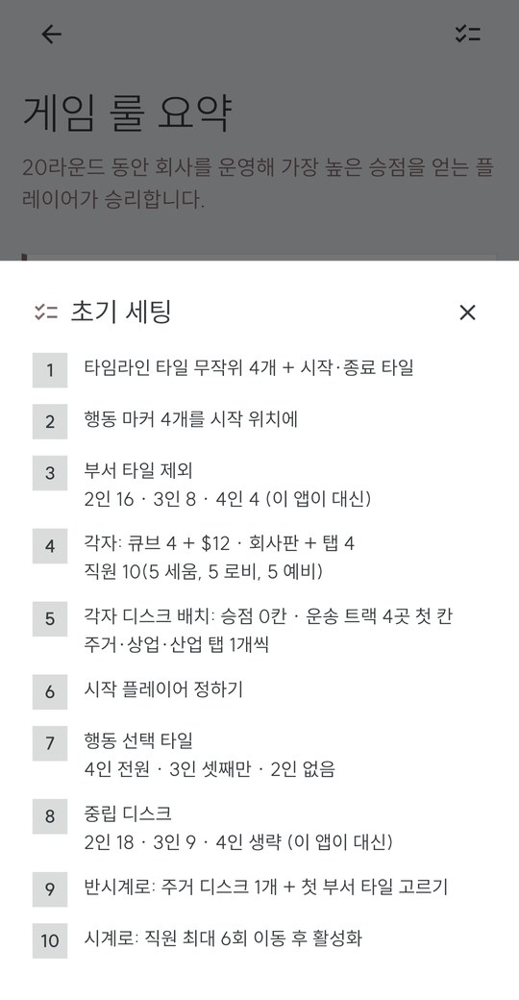
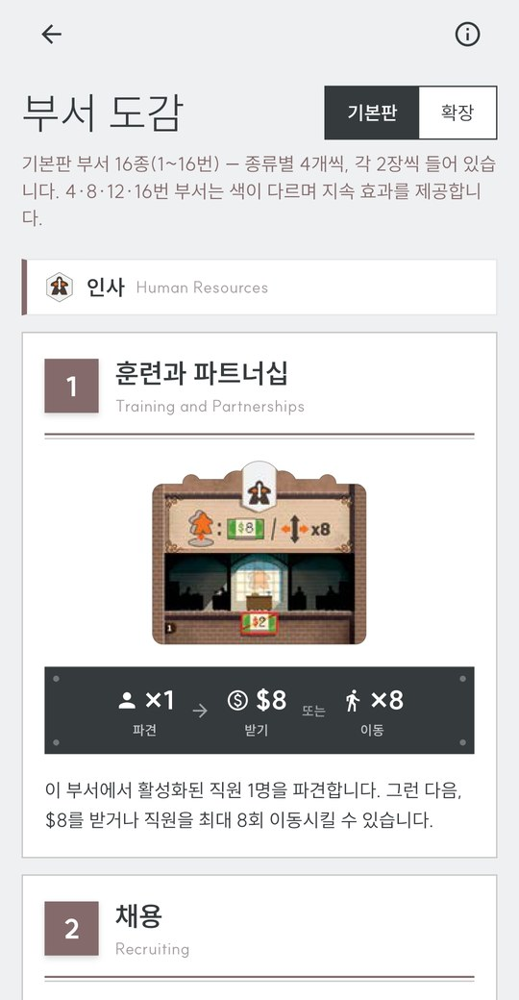
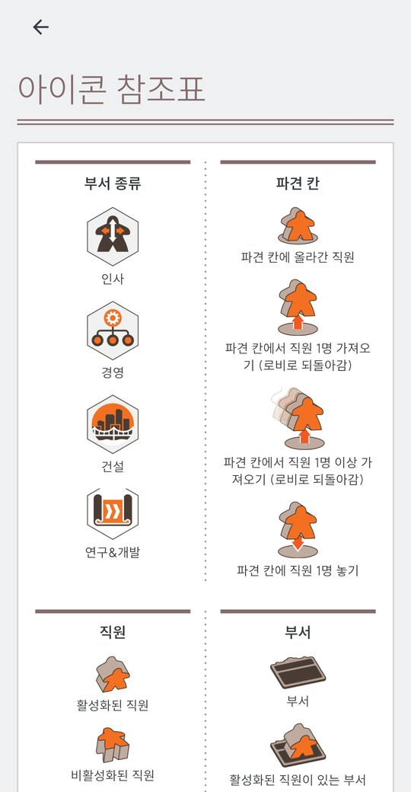

# 카네기 셀렉터 (Carnegie Setup Helper)

보드게임 **카네기(Carnegie)** 의 게임 준비를 한 번에 끝내주는 도우미 앱입니다.
인원수만 고르면 제외할 부서 타일과 중립 디스크 배치를 무작위로 뽑아 주고,
1인 게임 진행·룰 요약·부서 도감·아이콘 참조표까지 한 앱에 담았습니다.

Flutter로 만들어 **Android / iOS / 웹**을 지원합니다.

🌐 **웹 버전:** https://carnegie-setup-helper.krindale.workers.dev

## 스크린샷

<table>
  <tr>
    <td align="center"><br><sub>게임 준비</sub></td>
    <td align="center"><br><sub>부서 타일 제외</sub></td>
    <td align="center"><br><sub>중립 디스크 배치</sub></td>
    <td align="center"><br><sub>1인 도우미</sub></td>
  </tr>
  <tr>
    <td align="center"><br><sub>게임 룰 요약</sub></td>
    <td align="center"><br><sub>초기 세팅 체크리스트</sub></td>
    <td align="center"><br><sub>부서 도감</sub></td>
    <td align="center"><br><sub>아이콘 참조표</sub></td>
  </tr>
</table>

## 기능

| 화면 | 설명 |
|---|---|
| **게임 준비** | 1~2인 / 3인 / 4인 카드를 고르면 셋업이 한 번에 준비됩니다. 기본판 / 확장 포함 스위치. |
| **부서 타일** | 32장(16종 × 2) 중 인원별 16 / 8 / 4장을 무작위 제외. 요약(제외 타일만) · 상세(16종 전체, 유형별 섹션) 전환, 다시 뽑기. 타일은 유형 컬러 플레이트 · 한/영 이름 · 원본 타일 이미지 · 효과 요약 바로 구성되고 🗑×2 / 🗑×1 / ✓ 배지가 붙습니다. |
| **중립 디스크** | 2인 18개 / 3인 9개 세팅을 시뮬레이션. 기부 차트와 도시 건설 부지(서부·중서부·남부·동부)를 지역 색 배너로 표시. 1인·4인은 배치 없음 안내. |
| **1인 도우미** | 앤드류 카네기를 상대하는 라운드 진행 5단계, 앤드류 행동 해결, 이벤트, 점수 계산 요약. |
| **게임 룰 요약** | 라운드 진행 4단계 · 이벤트 · 부서 사용 등 핵심 규칙 요약과 초기 세팅 10단계 체크리스트 시트. |
| **부서 도감** | 기본판 / 확장 탭으로 32종 부서를 타일 컴포넌트 + 규칙 설명으로 열람. |
| **아이콘 참조표** | 규칙서 아이콘 47개를 투명 배경으로 추출해 설명과 함께 표시. |
| **확장 #1 지원** | 새로운 부서(17~32): 유형별 8종 중 4종을 뽑아 32장을 구성한 뒤 기본 제외 규칙 적용 — "종류 고르기 → 타일 제외" 2단계 안내. 새로운 시작: 입찰 시트($50 한도) 계산기. |

## 디자인

- Carbon Design System 구조 + 커스텀 팔레트
  `#EEF0F2` 배경 · `#DADCDB` 레이어 · `#C6C7C4` 보더 · `#A2999E` 헬퍼 · `#846A6A` 인터랙티브 · `#353B3C` 텍스트
- 부서 유형 4색: 인사 `#846A6A` · 경영 `#8A7A4F` · 건설 `#6D7D62` · 연구개발 `#7D6880`
- 서체: SUIT (Light · Regular · Bold · ExtraBold)
- 세로 화면 고정, 바운스 스크롤, 상단 바 없이 모서리 고정 아이콘

## 데이터 출처

- 부서 타일 제외 규칙: 규칙서 4쪽 (세팅 4)
- 중립 디스크 배치: 규칙서 4쪽 (세팅 9) + `CARNEGIE_SETUP_RANDOMIZER__V1.xlsx`
- 1인 게임 규칙: 규칙서 18–19쪽
- 확장 #1 (새로운 부서 · 새로운 시작): 확장 룰북 1–3쪽

## 프로젝트 구조

```
lib/
  main.dart          # 앱/테마, 게임 준비, 결과(부서 타일·중립 디스크·1인 도우미 탭)
  carbon.dart        # 디자인 토큰 + 공용 위젯
  dept_tile.dart     # 부서 타일 컴포넌트 (넘버 플레이트·괘선·엠블럼·효과 바)
  departments.dart   # 부서 32종 데이터, 기본/확장 뽑기 로직
  new_beginning.dart # 확장 "새로운 시작" 입찰 시트 계산기
  setup9.dart        # 중립 디스크(세팅 9) 카드 데이터·배치 로직
  reference.dart     # 부서 도감, 아이콘 참조표
  rules.dart         # 게임 룰 요약
assets/
  departments/       # 부서 타일 이미지 32종 (WebP, 투명 배경)
  reficons/          # 아이콘 참조표 47개 (WebP)
  pcount/            # 인원 아이콘 (WebP)
  fonts/             # SUIT 서체
web/_headers         # COOP/COEP — wasm 멀티스레드 렌더링용
wrangler.jsonc       # Cloudflare Workers 정적 에셋 배포 설정
```

빌드 주의사항, 에셋 파이프라인, 디자인 규칙 등 개발 상세는 [CLAUDE.md](CLAUDE.md)를 참고하세요.

## 실행 / 빌드

```sh
flutter pub get
flutter run -d chrome          # 웹
flutter run                    # 연결된 Android/iOS 기기
flutter build apk --release    # Android
```

### 웹 배포 (Cloudflare Workers)

`main` 브랜치에 푸시하면 GitHub Actions가 자동으로 빌드·배포합니다
(`.github/workflows/deploy-web.yml`). 수동 배포는:

```sh
flutter build web --wasm --release --base-href /
npx wrangler deploy
```
